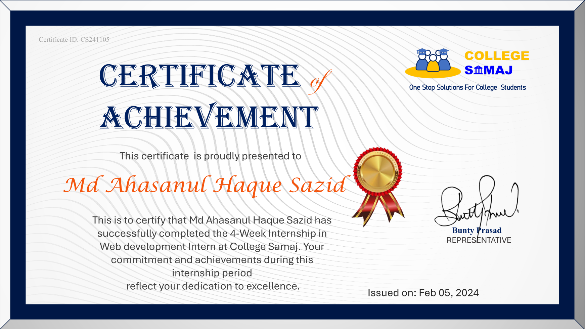

# 🏫 COLLEGESAMAJ  

## 📘 Overview  
**COLLEGESAMAJ** is a web development project created during my internship with **College Samaj**. The internship primarily focused on strengthening front-end and web development skills through real-world projects such as a **Calculator App** and a **Portfolio Website**.  

This repository demonstrates the knowledge and practical experience I gained during my **Web Development Internship** program at **College Samaj**.  

---

## 🎯 Objectives  
- Develop and enhance core web development skills (HTML, CSS, JavaScript).  
- Gain real-world experience through guided, project-based learning.  
- Learn to collaborate, debug, and use modern tools like Git & GitHub.  
- Create responsive and professional websites and apps.  

---

## 🧩 Project Structure  
```
COLLEGESAMAJ/
│
├── Calculator/        # JavaScript-based calculator project
├── Portfolio/         # Personal portfolio website
├── Certificate.pdf    # Internship completion certificate
├── Offer Letter.jpeg  # Official internship offer letter
└── README.md          # Project documentation
```

---

## 💼 Internship Details  
**Program:** Web Development Internship  
**Organization:** College Samaj  
**Duration:** January 5, 2024 – February 4, 2024  
**Intern:** Md Ahasanul Haque Sazid  
**Coordinators:** H. Yadav, Gaurav Rai, Bunty Prasad  

> This internship provided practical exposure to web development, guidance from experienced mentors, and valuable lessons in teamwork and project execution.  

---

## 🛠️ Technologies Used  
- **HTML5**  
- **CSS3**  
- **JavaScript (ES6+)**  
- **Git** / **GitHub**  

---

## 📜 Internship Offer Letter  
Below is a preview of the official **Internship Offer Letter** issued by *College Samaj*:  

  

📎 You can view or download the full version here:  
[View Offer Letter](./Offer%20Letter.jpeg)

---

## 🏆 Internship Certificate  
Here’s a preview of the **Internship Completion Certificate** received after successful completion of the program:  

  
*(If your certificate file is a PDF, you can upload a .png preview or just link to it below.)*  

📎 [View Certificate (PDF)](./Certificate.pdf)  

---

## 🚀 How to Run the Projects  
1. Clone this repository:  
   ```bash
   git clone https://github.com/sksazid01/COLLEGESAMAJ.git
   ```
2. Navigate to the project directory:  
   ```bash
   cd COLLEGESAMAJ
   ```
3. Open the `Calculator` or `Portfolio` folder.  
4. Run the project by opening the `index.html` file in your browser.  

---

## 🌟 Acknowledgments  
Special thanks to **College Samaj** for providing this incredible learning opportunity.  
Gratitude to the mentors and coordinators for their continuous support and constructive feedback throughout the internship journey.  

---

## 🔗 Additional Links  
- [College Samaj Official Website](https://www.collegesamaj.in)  
- [Internship Offer Letter (Google Drive)](https://drive.google.com/file/d/1CmP5Hys6hkMIoFNsbJEN7F86cZAk3Kt7/view?usp=sharing)  
- [LinkedIn Post Highlighting Internship](https://www.linkedin.com/in/md-ahasanul-haque-sazid)  

---

## 📄 License  
This repository is intended for educational and demonstration purposes only.  
